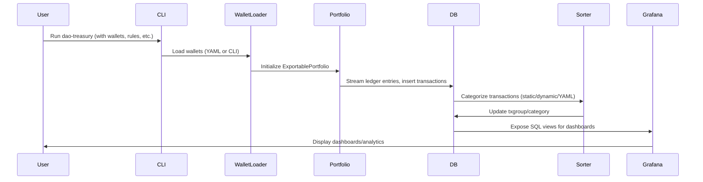

# Agent Requirements

All agents must follow these rules:

1) Fully test your changes before submitting a PR (run the full suite or all relevant tests).
2) PR titles must be descriptive and follow Conventional Commits-style prefixes:
   - Common: `feat:`, `fix:`, `chore:`, `refactor:`, `docs:`, `test:`, `perf:`
   - Support titles: `fix(docs):`, `fix(benchmarks):`, `fix(cicd):`
3) Commit messages must follow the same Conventional Commits-style prefixes and include a short functional description plus a user-facing value proposition.
4) PR descriptions must include Summary, Rationale, and Details sections.
5) Run relevant Python tests for changes (pytest/unittest or the repo's configured runner).
6) Follow formatting/linting configured in pyproject.toml, setup.cfg, tox.ini, or ruff.toml.
7) Update dependency lockfiles when adding or removing Python dependencies.
8) When adding or refactoring async RPC/price-fetching code, keep or add `y._decorators.stuck_coro_debugger` so the `y.stuck?` DEBUG logger continues emitting "still executing" messages at the default 5-minute interval (via `a_sync.debugging.stuck_coro_debugger`).
9) If you touch ypricemagic-driven price lookups or related docs, keep the `y.stuck?` logger guidance accurate (DEBUG-only, 5-minute interval) so long-running calls can be diagnosed.
10) If the repo uses mypyc, verify tests run against compiled extensions (not interpreted Python) and note how you confirmed.
11) If the branch you're assigned to work on is from a remote (ie origin/master or upstream/awesome-feature) you must ensure you fetch and pull from the remote before you begin your work.
12) All mypy configuration (flags, overrides, per-module ignores, and file targets) should go in pyproject.toml. Do not split config across CLI args, mypy.ini, setup.cfg, or workflow steps.
13) Use one of `paths` or `paths-ignore` in every workflow file to make sure workflows only run when required.
14) Maximize the use of caching in GitHub workflow files to minimize run duration.
15) Centralize pytest settings (flags, markers, ignore patterns, and targets) in pyproject.toml, pytest.ini, setup.cfg, or tox.ini; workflows/hooks should call pytest without inline args.
16) Local pip install . generates build/; clean up before closing a worktree to avoid dirty state.

Reference: https://www.conventionalcommits.org/en/v1.0.0/

---

# DAO Treasury - System Overview for LLMs and Technical Contributors

AGENTS.md is the single entry point for system overview context.

## Project Purpose

DAO Treasury is a modular, extensible analytics and reporting system for decentralized organizations. It ingests on-chain data, models and categorizes transactions, and provides professional dashboards for financial transparency and decision-making.

---

## System Architecture

```mermaid
flowchart TD
    subgraph Blockchain
        A[On-chain Data]
    end
    subgraph Ingestion
        B[Wallet Loader]
        C[Ledger Entry Stream]
    end
    subgraph DataModel
        D[Pony ORM Entities]
        E[SQL Views]
    end
    subgraph Processing
        F[Sorting and Categorization]
        G[Streams (LlamaPay)]
    end
    subgraph Analytics
        H[Grafana Dashboards]
        I[Renderer]
    end

    A --> B
    B --> C
    C --> D
    D --> E
    E --> F
    F --> H
    G --> D
    G --> F
    E --> G
    H --> I
```

---

## Core Components

### 1. Data Model and Persistence

- **Pony ORM**: Defines entities for chains, addresses, tokens, transaction groups, treasury transactions, streams, and streamed funds.
- **SQL Views**: Created for reporting and analytics (e.g., general ledger, stream ledger, monthly PnL).
- **Extensible**: New entities and relationships can be added by following ORM and view patterns.

### 2. Wallet Management

- **TreasuryWallet**: Dataclass for DAO wallet addresses, with metadata (start/end block/timestamp, networks).
- **YAML Loader**: Supports advanced wallet configuration via YAML.

### 3. Transaction Ingestion

- **LedgerEntry**: Ingests on-chain transactions using eth-portfolio and Brownie.
- **Async Processing**: Uses a_sync and thread pools for efficient, non-blocking ingestion.

### 4. Sorting and Categorization

- **Static and Dynamic Rules**: Attribute-based (e.g., address, hash) and function/decorator-based (custom logic).
- **YAML Rules**: External, declarative rules loaded at runtime.
- **Matchers**: Fast lookup for from/to address and hash-based categorization.
- **Factories**: Decorator/factory pattern for registering new rules.
- **Extensible**: Add new rules via code or YAML.

### 5. Streams (LlamaPay and More)

- **LlamaPayProcessor**: Handles streaming payments, processes on-chain events, and amortizes streams for analytics.
- **Extensible**: Add new streaming protocols by following the established pattern.

### 6. Dashboarding and Analytics

- **Grafana**: Dashboards provisioned via JSON, orchestrated with Docker Compose.
- **Renderer**: Optional container for exporting dashboards as images.
- **Persistent Storage**: All dashboard data and settings are persisted.

---

## Data Flow



---

## Extensibility

- **Add a new sort rule**: Use a factory (e.g., `@expense("Gas")`) or add to YAML.
- **Add a new dashboard**: Create/export JSON in Grafana, place in provisioning directory.
- **Add a new stream protocol**: Implement a processor class, register in streams module.
- **Add a new entity**: Define ORM class, update views as needed.

---

## Key Technical Patterns

- **Type Safety**: Extensive use of type hints and `Final`.
- **Async**: Async processing for ingestion and streaming.
- **Modularity**: Clear separation of concerns, extensible via factories and YAML.
- **Testing**: pytest and mypy for quality.
- **Performance**: Critical modules and constants are compiled with [mypyc](https://mypyc.readthedocs.io/en/latest/) for C-level speed. All constants are marked with `Final`, enabling mypyc to generate extremely fast, immutable C constants at runtime. Contributors should use `Final` for any new constants to maximize performance.
- **Security**: Secrets via environment variables, explicit error handling.

---

## Further Documentation

- [Sphinx Docs](./docs/index.rst)
- [Sort Rules](./docs/sort_rules.rst)
- [Wallets](./docs/wallets.rst)
- [Dashboards](./docs/dashboards.rst)
- [CONTRIBUTING.md](./CONTRIBUTING.md)
- [API Reference](./docs/source/modules.rst)

---

**For LLMs:**
All categorization, reporting, and analytics logic is discoverable via the sorting subsystem and SQL views. For code generation or refactoring, follow the established patterns in the ORM, sorting, and dashboard provisioning modules.
