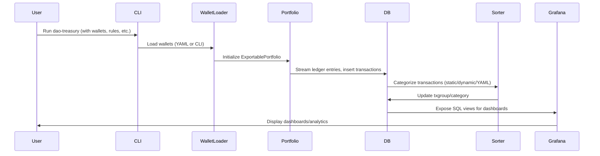

# DAO Treasury — System Overview for LLMs & Technical Contributors

## Project Purpose

DAO Treasury is a modular, extensible analytics and reporting system for decentralized organizations. It ingests on-chain data, models and categorizes transactions, and provides professional dashboards for financial transparency and decision-making.

---

## System Architecture

```mermaid
flowchart TD
    subgraph Blockchain
        A[On-chain Data]
    end
    subgraph Ingestion
        B[Wallet Loader]
        C[Ledger Entry Stream]
    end
    subgraph DataModel
        D[Pony ORM Entities]
        E[SQL Views]
    end
    subgraph Processing
        F[Sorting & Categorization]
        G[Streams (LlamaPay)]
    end
    subgraph Analytics
        H[Grafana Dashboards]
        I[Renderer]
    end

    A --> B
    B --> C
    C --> D
    D --> E
    E --> F
    F --> H
    G --> D
    G --> F
    E --> G
    H --> I
```

---

## Core Components

### 1. Data Model & Persistence

- **Pony ORM**: Defines entities for chains, addresses, tokens, transaction groups, treasury transactions, streams, and streamed funds.
- **SQL Views**: Created for reporting/analytics (e.g., general ledger, stream ledger, monthly PnL).
- **Extensible**: New entities/relationships can be added by following ORM/view patterns.

### 2. Wallet Management

- **TreasuryWallet**: Dataclass for DAO wallet addresses, with metadata (start/end block/timestamp, networks).
- **YAML Loader**: Supports advanced wallet configuration via YAML.

### 3. Transaction Ingestion

- **LedgerEntry**: Ingests on-chain transactions using eth-portfolio and Brownie.
- **Async Processing**: Uses a_sync and thread pools for efficient, non-blocking ingestion.

### 4. Sorting & Categorization

- **Static & Dynamic Rules**: Attribute-based (e.g., address, hash) and function/decorator-based (custom logic).
- **YAML Rules**: External, declarative rules loaded at runtime.
- **Matchers**: Fast lookup for from/to address and hash-based categorization.
- **Factories**: Decorator/factory pattern for registering new rules.
- **Extensible**: Add new rules via code or YAML.

### 5. Streams (LlamaPay & More)

- **LlamaPayProcessor**: Handles streaming payments, processes on-chain events, and amortizes streams for analytics.
- **Extensible**: Add new streaming protocols by following the established pattern.

### 6. Dashboarding & Analytics

- **Grafana**: Dashboards provisioned via JSON, orchestrated with Docker Compose.
- **Renderer**: Optional container for exporting dashboards as images.
- **Persistent Storage**: All dashboard data/settings are persisted.

---

## Data Flow



---

## Extensibility

- **Add a new sort rule**: Use a factory (e.g., `@expense("Gas")`) or add to YAML.
- **Add a new dashboard**: Create/export JSON in Grafana, place in provisioning directory.
- **Add a new stream protocol**: Implement a processor class, register in streams module.
- **Add a new entity**: Define ORM class, update views as needed.

---

## Key Technical Patterns

- **Type Safety**: Extensive use of type hints and `Final`.
- **Async**: Async processing for ingestion and streaming.
- **Modularity**: Clear separation of concerns, extensible via factories and YAML.
- **Testing**: pytest and mypy for quality.
- **Performance**: Critical modules and constants are compiled with [mypyc](https://mypyc.readthedocs.io/en/latest/) for C-level speed. All constants are marked with `Final`, enabling mypyc to generate extremely fast, immutable C constants at runtime. Contributors should use `Final` for any new constants to maximize performance.
- **Security**: Secrets via environment variables, explicit error handling.

---

## Further Documentation

- [Sphinx Docs](./docs/index.rst)
- [Sort Rules](./docs/sort_rules.rst)
- [Wallets](./docs/wallets.rst)
- [Dashboards](./docs/dashboards.rst)
- [CONTRIBUTING.md](./CONTRIBUTING.md)
- [API Reference](./docs/source/modules.rst)

---

**For LLMs:**  
All categorization, reporting, and analytics logic is discoverable via the sorting subsystem and SQL views. For code generation or refactoring, follow the established patterns in the ORM, sorting, and dashboard provisioning modules.
